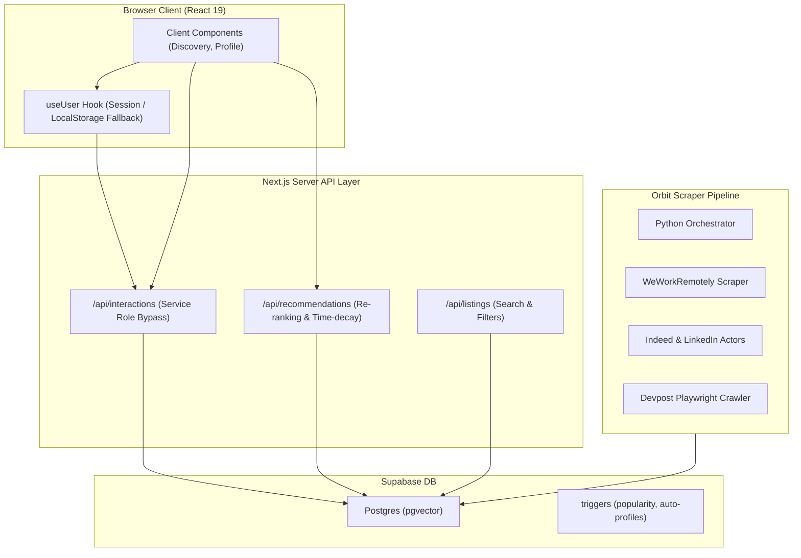

# DevDrift — Project State & Hand-off Document

> **Last Updated:** June 11, 2026  
> **Conversational Status:** Compiled codebase, completed key authentication, interaction routing, scraper pagination, and audit foundations. Ready for further development.
> **Build Status:** ✅ Production build passes (`npm run build` compiles successfully)
> **Active Dev Server:** `npm run dev` running on `localhost`

---

## 1. Project Overview & Architecture

**DevDrift** is a modern developer opportunity aggregator and recommendation platform. It combines a high-aesthetic Next.js App Router web frontend with a Postgres + `pgvector` Supabase backend, supported by a Python scraping pipeline (codenamed **Orbit**).



---

## 2. Completed Milestones

### 2.1 WeWorkRemotely RSS Scraper Integration
- **Scraper Added:** Created [weworkremotely.py](file:///c:/Users/SmilinJasper/Desktop/projects/Test/DevDrift/scraper/weworkremotely.py) to parse the WeWorkRemotely RSS feed (`remote-programming-jobs.rss`). It filters jobs using default keywords.
- **Normalizer Rules:** Added `normalize_wwr_job` in [normalizer.py](file:///c:/Users/SmilinJasper/Desktop/projects/Test/DevDrift/scraper/normalizer.py) to extract clean job titles, company metadata (stripping `"Company: Title"` format), descriptions (stripping HTML tags), and tag classifying remote parameters.
- **Sync integration:** Wired source hooks inside [jobs.py](file:///c:/Users/SmilinJasper/Desktop/projects/Test/DevDrift/scraper/jobs.py) and [main.py](file:///c:/Users/SmilinJasper/Desktop/projects/Test/DevDrift/scraper/main.py) to include WeWorkRemotely in the main scraping pipeline.

### 2.2 Next.js Client Authentication Hook (`useUser`)
- **Dynamic Session Loading:** Replaced hardcoded client-side guest profiles (the `MOCK_USER_ID`) with the [useUser.ts](file:///c:/Users/SmilinJasper/Desktop/projects/Test/DevDrift/src/hooks/useUser.ts) custom React hook.
- **Session Observer:** The hook observes Supabase authentication states on client mount. If an active session is found, it supplies the user's authentic `UUID`. For unauthenticated visitors, it falls back to the Guest ID (`00000000-0000-0000-0000-000000000000`) and falls back to syncing interactions via LocalStorage (`orbit_saved_listings`).

### 2.3 Custom Interactions API Layer (Bypassing Supabase RLS Limits)
- **RLS Write Failure Fixed:** Fixed a bug where saved opportunities did not persist or show up in the user profile dashboard because client-side direct writes to the `interactions` table were blocked by restrictive Row Level Security (RLS) policies.
- **API Endpoint:** Created `/api/interactions` in [route.ts](file:///c:/Users/SmilinJasper/Desktop/projects/Test/DevDrift/src/app/api/interactions/route.ts) that handles `POST` and `DELETE` requests.
- **Service Role Execution:** Next.js Server routes process requests using the privileged `SUPABASE_SERVICE_ROLE_KEY` to securely update the database, allowing users to save/unsave elements.
- **Client Adaptor Refactor:** Modified `saveListingOptimistic` and `unsaveListingOptimistic` in [interactions.ts](file:///c:/Users/SmilinJasper/Desktop/projects/Test/DevDrift/src/lib/supabase/interactions.ts) to send HTTP requests to the new API router instead of direct client-side insertions.

### 2.4 Profile Sign-Out Button Bugfix
- **Sign-Out Fix:** Added `type="submit"` to the form button in [src/app/profile/page.tsx](file:///c:/Users/SmilinJasper/Desktop/projects/Test/DevDrift/src/app/profile/page.tsx) to ensure clicking the sign-out button correctly invokes the server action backend handler.

### 2.5 Scraper Pagination Fix (Bypassing the Supabase 1000-Row Select Limit)
- **Problem:** Supabase enforces a hard limit of 1000 returned rows on `select()` calls. The Python sync pipeline in [db.py](file:///c:/Users/SmilinJasper/Desktop/projects/Test/DevDrift/scraper/db.py) used to pull existing jobs in a single call to detect updates. Once the database reached 1000+ entries, older entries were ignored, causing duplicates and incorrect deletions.
- **Fix:** Implemented chunk-based pagination inside a `while` loop using `.range(start, end)` in [scraper/db.py](file:///c:/Users/SmilinJasper/Desktop/projects/Test/DevDrift/scraper/db.py#L92-L108). The scraper now loads all existing listings paginated, ensuring accurate synchronization regardless of database size.

---

## 3. Current Directory Layout

```
DevDrift/
├── scraper/                        # Orbit scraping engine (Python 3.11)
│   ├── main.py                     # Entry point orchestrator
│   ├── db.py                       # Syncs scraped jobs to DB (paginated select fix)
│   ├── weworkremotely.py           # [NEW] WeWorkRemotely RSS feed parser
│   ├── normalizer.py               # Field classifier and HTML-stripper (updated)
│   └── jobs.py                     # Job aggregator configuration mapping
├── src/
│   ├── app/
│   │   ├── api/
│   │   │   ├── interactions/       # [NEW] POST/DELETE routes using service role
│   │   │   └── recommendations/    # Re-ranking & decay API endpoint
│   │   ├── discover/
│   │   │   └── DiscoveryClient.tsx # Search, layout, filters & pagination UI
│   │   └── profile/
│   │       └── page.tsx            # Dashboard containing saved listings and sign-out controls
│   ├── components/
│   │   ├── HomeFeed.tsx            # Infinite scroll opportunity cards
│   │   └── ListingCard.tsx         # Premium design cards (optimistic save hooks)
│   ├── hooks/
│   │   ├── useInfiniteScroll.ts    # Observer targets state-hook (refactored)
│   │   └── useUser.ts              # [NEW] Auth-listener session hook
│   └── lib/
│       └── supabase/
│           └── interactions.ts     # Save/Unsave HTTP requests (updated)
```

---

## 4. Supabase Database Schema

### 4.1 Core Tables
1. **`public.profiles`**: Contains usernames, bio, custom interest tags (`interests` text array), and local 384-dimensional interest embeddings (`interest_embedding`).
2. **`public.listings`**: Aggregated opportunity details: description, tags, type, location, application links, popularity metrics, and embeddings.
3. **`public.interactions`**: Logs interactions (`view` or `save`) mapping user UUIDs to listing UUIDs. It features a unique index to prevent duplicate saves.

### 4.2 Automation Triggers
* **Auto-Profile Trigger**: Creates a public profile entry when a user signs up.
* **Popularity Scorer Trigger**: Listens for saves/views. Updates the listing `popularity_score` instantly (`+5.0` for save, `+1.0` for view, `-5.0` for unsave, `-1.0` for unview) with a floor constraint of `0.0`.

---

## 5. Audit Findings & Remaining Tasks

A comprehensive codebase audit was completed and is stored in [implementation_plan.md](file:///C:/Users/SmilinJasper/.gemini/antigravity-ide/brain/2bc90cb1-fb05-4455-813b-95a107413e3e/implementation_plan.md). Below is the backlog of remaining audit tasks.

```markdown
- [ ] **2. Security Vulnerabilities**
  - [ ] **2.1. Unauthenticated ID Forging in Recommendations**
    - *File:* [src/app/api/recommendations/route.ts](file:///c:/Users/SmilinJasper/Desktop/projects/Test/DevDrift/src/app/api/recommendations/route.ts)
    - *Action:* Restrict `searchParams.get("userId")` to permit the guest profile ID (`MOCK_USER_ID`) only. Return `401 Unauthorized` if an unauthenticated user provides a valid database user UUID.
  - [ ] **2.2. Unprotected Views Endpoint (Rate Limiting)**
    - *File:* [src/app/api/interactions/route.ts](file:///c:/Users/SmilinJasper/Desktop/projects/Test/DevDrift/src/app/api/interactions/route.ts)
    - *Action:* Protect against view-spamming by tracking view events locally or using cookies, preventing a single user from inflating listing popularity.

- [ ] **3. Performance Bottlenecks**
  - [ ] **3.1. Intersection Observer Pooling**
    - *File:* [src/components/ListingCard.tsx](file:///c:/Users/SmilinJasper/Desktop/projects/Test/DevDrift/src/components/ListingCard.tsx)
    - *Action:* Eliminate multiple individual intersection observers. Set up a shared observer hook/singleton to monitor visible cards and trigger view logging.
  - [ ] **3.2. Scraper Deletion Batches**
    - *File:* [scraper/db.py](file:///c:/Users/SmilinJasper/Desktop/projects/Test/DevDrift/scraper/db.py)
    - *Action:* Increase the deletion batch size from `50` to `500` to speed up database synchronization cycles.

- [ ] **4. Clean Code & Refactoring**
  - [ ] **4.1. Deduplicate Keyset Pagination & Base64 Logic**
    - *Files:* [src/app/api/listings/route.ts](file:///c:/Users/SmilinJasper/Desktop/projects/Test/DevDrift/src/app/api/listings/route.ts) and [src/app/api/recommendations/route.ts](file:///c:/Users/SmilinJasper/Desktop/projects/Test/DevDrift/src/app/api/recommendations/route.ts)
    - *Action:* Extract shared pagination logic, constants, and base64 helper functions into a common file (e.g., `src/lib/utils/pagination.ts`). Replace the error-prone `atob`/`btoa` with Node-compatible `Buffer` base64 functions.

- [ ] **5. Unhandled Edge Cases**
  - [ ] **5.1. UI State Flash on Saved Items**
    - *File:* [src/app/discover/DiscoveryClient.tsx](file:///c:/Users/SmilinJasper/Desktop/projects/Test/DevDrift/src/app/discover/DiscoveryClient.tsx)
    - *Action:* Disable bookmark buttons or show a loading skeleton while `getSavedListingIds()` fetches the user's saved items on initial mount.
  - [ ] **5.2. Malformed Salary Formats in Normalizer**
    - *File:* [scraper/normalizer.py](file:///c:/Users/SmilinJasper/Desktop/projects/Test/DevDrift/scraper/normalizer.py)
    - *Action:* Update `_extract_salary` to handle cases where the currency is empty to prevent weird outputs (like `" 1000 - 2000"`).
```

---

## 6. How to Run & Validate

### 6.1 Run Frontend
```powershell
npm run dev
```

### 6.2 Test Database Pagination Logic (Scraper Helper)
A test script exists to simulate cursor pagination and confirm the page-by-page scraper execution:
```powershell
python test-pagination.py
node test-pagination.js
```

### 6.3 Run the Scraper Locally
```powershell
python scraper/main.py --dry-run
```
*(Remove `--dry-run` to execute actual Supabase upserts.)*
