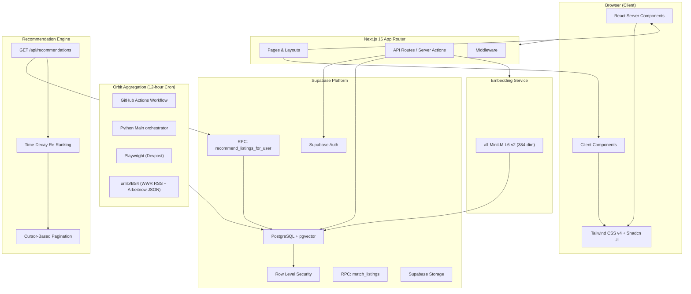
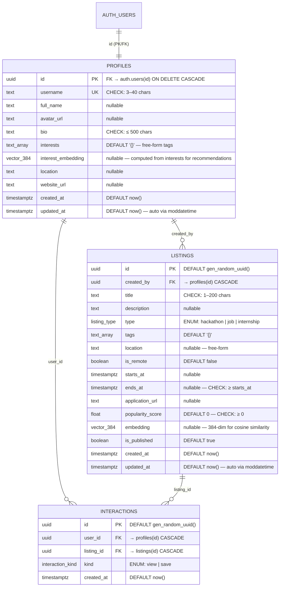
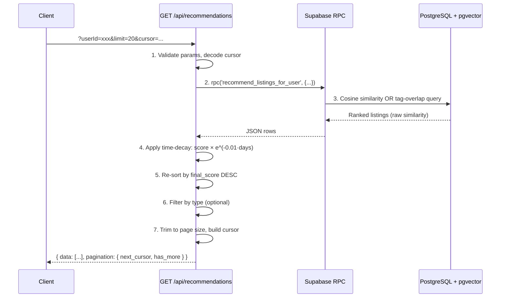

# DevDrift — Project State & Implementation Plan

> **Last updated:** 2026-06-05  
> **Phase:** 1 (Foundation) ✅ · 2 (Orbit Data Aggregation) ✅ · 3 (Recommendation Engine & UI) ✅  
> **Build status:** ✅ Production build passes (`npm run build` — compiled in 4.9s, Turbopack)

---

## Table of Contents

1. [Project Overview](#1-project-overview)
2. [Tech Stack & Architecture](#2-tech-stack--architecture)
3. [Project Structure](#3-project-structure)
4. [Configuration Files Reference](#4-configuration-files-reference)
5. [Supabase Database Schema](#5-supabase-database-schema)
6. [Recommendation Engine](#6-recommendation-engine)
7. [Implementation Checklist (Completed)](#7-implementation-checklist-completed)
8. [Pending Requirements](#8-pending-requirements)

---

## 1. Project Overview

**DevDrift** is a full-stack web application for discovering developer opportunities — hackathons, jobs, and internships — powered by semantic search via pgvector embeddings. Users can browse, save, and get personalised recommendations based on their interest tags.

### Core Value Propositions

| Feature | Description |
|---|---|
| **Semantic Discovery** | Vector similarity search (384-dim) matches listings to natural-language queries |
| **Multi-Type Listings** | Unified model for hackathons, jobs, and internships |
| **Personalisation** | User interest tags + interest embeddings + interaction history drive recommendations |
| **Time-Decay Ranking** | Exponential decay re-ranks recommendations so newer listings surface higher |
| **Infinite Pagination** | Cursor-based keyset pagination for seamless infinite scroll |
| **Real-Time Engagement** | Popularity scoring and save/view tracking per listing |
| **Orbit Aggregation** | Cron-scheduled scraper pipeline syncing opportunities globally & locally |

---

## 2. Tech Stack & Architecture

### 2.1 Frontend

| Layer | Technology | Version | Notes |
|---|---|---|---|
| **Framework** | Next.js (App Router) | `16.2.7` | React Server Components enabled |
| **Language** | TypeScript | `^5` | Strict mode, bundler module resolution |
| **UI Library** | Shadcn UI | `^4.10.0` | `base-nova` style, RSC-compatible |
| **Primitives** | Base UI (React) | `^1.5.0` | Headless primitives under Shadcn |
| **Styling** | Tailwind CSS | `^4` | v4 with PostCSS, CSS variables (oklch) |
| **Animations** | tw-animate-css | `^1.4.0` | Tailwind animation utilities |
| **Icons** | Lucide React | `^1.17.0` | Tree-shakeable SVG icon library |
| **Class Utils** | clsx + tailwind-merge | `^2.1.1` / `^3.6.0` | Via `cn()` helper in `src/lib/utils.ts` |
| **Variant System** | class-variance-authority | `^0.7.1` | Component variant definitions |
| **Fonts** | Geist Sans + Geist Mono | Google Fonts | CSS variables: `--font-geist-sans`, `--font-geist-mono` |

### 2.2 Backend & Data

| Layer | Technology | Version | Notes |
|---|---|---|---|
| **Backend** | Next.js API Routes / Server Actions | `16.2.7` | App Router server-side capabilities |
| **Database** | Supabase (PostgreSQL) | — | Managed Postgres with Auth, Storage, Realtime |
| **Supabase JS** | `@supabase/supabase-js` | `^2.107.0` | JavaScript client SDK |
| **Supabase SSR** | `@supabase/ssr` | `^0.10.3` | Server-side rendering auth utilities |
| **Vector Search** | pgvector extension | 384-dim | IVFFlat cosine index on `listings.embedding` |
| **Text Search** | pg_trgm extension | — | Trigram-based fuzzy matching |
| **Auth** | Supabase Auth | — | Row Level Security (RLS) integrated |
| **Timestamps** | moddatetime extension | — | Auto `updated_at` via triggers |

### 2.3 Scraper Pipeline (Orbit)

| Layer | Technology | Notes |
|---|---|---|
| **Language** | Python `3.11` | Scraper implementation language |
| **Automation** | Playwright (Python) | Headless Chromium rendering for Devpost hackathons |
| **Parser** | BeautifulSoup4 | DOM selector extraction for listings data |
| **Scheduler** | GitHub Actions | 12-hour cron job workflow scheduler |
| **Integration** | Supabase Python SDK | Pushes listings via service role authentication |

### 2.4 Architecture Diagram



### 2.5 Path Aliases

| Alias | Resolves To | Usage |
|---|---|---|
| `@/*` | `./src/*` | All imports |
| `@/components` | `./src/components` | React components |
| `@/components/ui` | `./src/components/ui` | Shadcn UI primitives |
| `@/lib` | `./src/lib` | Utility libraries |
| `@/hooks` | `./src/hooks` | Custom React hooks |
| `@/types` | `./src/types` | TypeScript type definitions |

---

## 3. Project Structure

```
DevDrift/
├── .env.local.example              # Environment variable template (Supabase keys)
├── .git/                           # Git repository
├── .github/
│   └── workflows/
│       └── scrape.yml              # Orbit scraper cron workflow (12-hour schedule)
├── .next/                          # Next.js build output (gitignored)
├── node_modules/                   # Dependencies (gitignored)
├── public/                         # Static assets
│   ├── file.svg
│   ├── globe.svg
│   ├── next.svg
│   ├── vercel.svg
│   └── window.svg
├── scraper/                        # Orbit Data Aggregation Scraper Pipeline (Python)
│   ├── config.py                   # Connections and scraping configurations
│   ├── db.py                       # Supabase client initialization & upsert logic
│   ├── devpost.py                  # Playwright Devpost scraper
│   ├── jobs.py                     # We Work Remotely & Arbeitnow scraper
│   ├── main.py                     # Entrypoint orchestration script
│   ├── normalizer.py               # Data formatting & schema mapping helper
│   └── requirements.txt            # Python requirements
├── src/
│   ├── app/                        # Next.js App Router
│   │   ├── api/
│   │   │   └── recommendations/
│   │   │       └── route.ts        # GET /api/recommendations — personalised feed
│   │   ├── favicon.ico
│   │   ├── globals.css             # Tailwind v4 + Shadcn theme (oklch vars)
│   │   ├── layout.tsx              # Root layout (Geist fonts, metadata)
│   │   └── page.tsx                # Home page (scaffold default)
│   ├── components/
│   │   └── ui/
│   │       └── button.tsx          # Shadcn Button (base-nova + CVA)
│   ├── lib/
│   │   ├── supabase/
│   │   │   ├── client.ts           # Browser-side Supabase client (createBrowserClient)
│   │   │   └── server.ts           # Server-side Supabase client (createServerClient)
│   │   └── utils.ts                # cn() — clsx + tailwind-merge
│   └── types/
│       └── database.ts             # TypeScript types mirroring Supabase schema
├── supabase/
│   └── migrations/
│       ├── 00001_initial_schema.sql     # Core schema (profiles, listings, interactions, RLS)
│       └── 00002_recommendation_engine.sql  # interest_embedding + recommend_listings_for_user RPC
├── .gitignore
├── AGENTS.md                       # Next.js agent rules
├── CLAUDE.md                       # Claude config
├── README.md
├── components.json                 # Shadcn UI configuration
├── eslint.config.mjs               # ESLint 9 flat config
├── next-env.d.ts                   # Next.js TypeScript env declarations
├── next.config.ts                  # Next.js configuration (empty)
├── package-lock.json
├── package.json                    # Project manifest
├── postcss.config.mjs              # PostCSS → Tailwind v4
├── tsconfig.json                   # TypeScript configuration
└── dev_drift_project_state.md      # ← This file
```

---

## 4. Configuration Files Reference

### 4.1 `package.json`

```json
{
  "name": "devdrift",
  "version": "0.1.0",
  "private": true,
  "scripts": {
    "dev": "next dev",
    "build": "next build",
    "start": "next start",
    "lint": "eslint"
  }
}
```

**Runtime Dependencies:** `next@16.2.7`, `react@19.2.4`, `react-dom@19.2.4`, `@supabase/supabase-js@^2.107.0`, `@supabase/ssr@^0.10.3`, `shadcn@^4.10.0`, `@base-ui/react@^1.5.0`, `class-variance-authority@^0.7.1`, `clsx@^2.1.1`, `lucide-react@^1.17.0`, `tailwind-merge@^3.6.0`, `tw-animate-css@^1.4.0`

**Dev Dependencies:** `@tailwindcss/postcss@^4`, `@types/node@^20`, `@types/react@^19`, `@types/react-dom@^19`, `eslint@^9`, `eslint-config-next@16.2.7`, `tailwindcss@^4`, `typescript@^5`

### 4.2 `components.json` (Shadcn UI)

| Setting | Value |
|---|---|
| Style | `base-nova` |
| RSC | `true` |
| TSX | `true` |
| Base Color | `neutral` |
| CSS Variables | `true` (oklch) |
| Icon Library | `lucide` |
| RTL | `false` |

### 4.3 `tsconfig.json`

- **Target:** ES2017
- **Module:** ESNext (bundler resolution)
- **Strict mode:** Enabled
- **JSX:** react-jsx
- **Path alias:** `@/*` → `./src/*`
- **Plugin:** `next` (type-checked routes)

### 4.4 Theme System (`globals.css`)

The theme uses **oklch** color space for perceptually uniform colors with full light/dark mode support via the `.dark` class.

| Token | Light | Dark |
|---|---|---|
| `--background` | `oklch(1 0 0)` | `oklch(0.145 0 0)` |
| `--foreground` | `oklch(0.145 0 0)` | `oklch(0.985 0 0)` |
| `--primary` | `oklch(0.205 0 0)` | `oklch(0.922 0 0)` |
| `--secondary` | `oklch(0.97 0 0)` | `oklch(0.269 0 0)` |
| `--muted` | `oklch(0.97 0 0)` | `oklch(0.269 0 0)` |
| `--destructive` | `oklch(0.577 0.245 27.325)` | `oklch(0.704 0.191 22.216)` |
| `--border` | `oklch(0.922 0 0)` | `oklch(1 0 0 / 10%)` |
| `--radius` | `0.625rem` | `0.625rem` |

### 4.5 Environment Variables (`.env.local.example`)

```bash
NEXT_PUBLIC_SUPABASE_URL=your-project-url-here
NEXT_PUBLIC_SUPABASE_ANON_KEY=your-anon-key-here
```

---

## 5. Supabase Database Schema

> **Migrations:**
> - [`00001_initial_schema.sql`](file:///c:/Users/SmilinJasper/Desktop/projects/Test/DevDrift/supabase/migrations/00001_initial_schema.sql) — Core tables, indexes, RLS, triggers
> - [`00002_recommendation_engine.sql`](file:///c:/Users/SmilinJasper/Desktop/projects/Test/DevDrift/supabase/migrations/00002_recommendation_engine.sql) — `interest_embedding` column + `recommend_listings_for_user` RPC

### 5.1 Extensions

```sql
CREATE EXTENSION IF NOT EXISTS vector    WITH SCHEMA extensions;  -- pgvector (semantic search)
CREATE EXTENSION IF NOT EXISTS pg_trgm   WITH SCHEMA extensions;  -- Trigram fuzzy text search
CREATE EXTENSION IF NOT EXISTS moddatetime WITH SCHEMA extensions;  -- Auto updated_at
```

### 5.2 Custom Enums

```sql
CREATE TYPE public.listing_type AS ENUM ('hackathon', 'job', 'internship');
CREATE TYPE public.interaction_kind AS ENUM ('view', 'save');
```

### 5.3 Entity-Relationship Diagram



### 5.4 Indexes

| Table | Index | Type | Details |
|---|---|---|---|
| `profiles` | `idx_profiles_username` | B-tree | Fast username lookups |
| `profiles` | `idx_profiles_interests` | GIN | Array containment queries on tags |
| `listings` | `idx_listings_type` | B-tree | Filter by listing type |
| `listings` | `idx_listings_created_by` | B-tree | Find listings by creator |
| `listings` | `idx_listings_location` | B-tree | Location-based filtering |
| `listings` | `idx_listings_starts_at` | B-tree | Date range queries |
| `listings` | `idx_listings_popularity` | B-tree (DESC) | Sort by popularity |
| `listings` | `idx_listings_tags` | GIN | Array containment on tags |
| `listings` | `idx_listings_is_published` | Partial B-tree | WHERE `is_published = true` |
| `listings` | `idx_listings_embedding` | **IVFFlat** | `vector_cosine_ops`, `lists = 100` |
| `interactions` | `idx_interactions_user_id` | B-tree | User's interactions |
| `interactions` | `idx_interactions_listing_id` | B-tree | Listing's interactions |
| `interactions` | `idx_interactions_kind` | B-tree | Filter by kind |
| `interactions` | `idx_interactions_created_at` | B-tree (DESC) | Recent interactions |
| `interactions` | `idx_interactions_user_listing_kind` | Composite B-tree | "Did user save this?" fast path |

### 5.5 RLS Policies

| Table | Policy | Action | Rule |
|---|---|---|---|
| `profiles` | Profiles are viewable by everyone | `SELECT` | `USING (true)` |
| `profiles` | Users can update their own profile | `UPDATE` | `auth.uid() = id` |
| `profiles` | Users can delete their own profile | `DELETE` | `auth.uid() = id` |
| `listings` | Published listings are viewable by everyone | `SELECT` | `is_published = true` |
| `listings` | Authenticated users can create listings | `INSERT` | `auth.uid() = created_by` |
| `listings` | Users can update their own listings | `UPDATE` | `auth.uid() = created_by` |
| `listings` | Users can delete their own listings | `DELETE` | `auth.uid() = created_by` |
| `interactions` | Users can view their own interactions | `SELECT` | `auth.uid() = user_id` |
| `interactions` | Authenticated users can create interactions | `INSERT` | `auth.uid() = user_id` |
| `interactions` | Users can delete their own interactions | `DELETE` | `auth.uid() = user_id` |

### 5.6 Database Functions (RPCs)

| Function | Language | Purpose |
|---|---|---|
| `handle_new_user()` | PL/pgSQL | Auto-creates a `profiles` row when a user signs up via Supabase Auth (trigger on `auth.users` INSERT) |
| `match_listings(query_embedding, match_threshold, match_count)` | SQL | Generic semantic search — returns top-N listings most similar to a given embedding vector |
| `recommend_listings_for_user(p_user_id, p_match_threshold, p_limit, p_cursor_score, p_cursor_id)` | PL/pgSQL | Personalised recommendations — cosine similarity search (when user has `interest_embedding`) or tag-overlap + popularity fallback. Excludes interacted listings. Keyset pagination. |

### 5.7 Triggers

| Trigger | Table | Timing | Purpose |
|---|---|---|---|
| `handle_profiles_updated_at` | `profiles` | `BEFORE UPDATE` | Auto-update `updated_at` via `moddatetime` |
| `handle_listings_updated_at` | `listings` | `BEFORE UPDATE` | Auto-update `updated_at` via `moddatetime` |
| `on_auth_user_created` | `auth.users` | `AFTER INSERT` | Auto-create profile row via `handle_new_user()` |

### 5.8 Grants

```sql
GRANT USAGE ON SCHEMA public TO anon, authenticated;

-- Profiles
GRANT SELECT ON public.profiles TO anon, authenticated;
GRANT INSERT, UPDATE, DELETE ON public.profiles TO authenticated;

-- Listings
GRANT SELECT ON public.listings TO anon, authenticated;
GRANT INSERT, UPDATE, DELETE ON public.listings TO authenticated;

-- Interactions
GRANT SELECT, INSERT, DELETE ON public.interactions TO authenticated;

-- Functions
GRANT EXECUTE ON FUNCTION public.match_listings TO anon, authenticated;
GRANT EXECUTE ON FUNCTION public.recommend_listings_for_user TO anon, authenticated;
```

---

## 6. Recommendation Engine

> **Files:**
> - RPC: [`00002_recommendation_engine.sql`](file:///c:/Users/SmilinJasper/Desktop/projects/Test/DevDrift/supabase/migrations/00002_recommendation_engine.sql)
> - API: [`src/app/api/recommendations/route.ts`](file:///c:/Users/SmilinJasper/Desktop/projects/Test/DevDrift/src/app/api/recommendations/route.ts)
> - Types: [`src/types/database.ts`](file:///c:/Users/SmilinJasper/Desktop/projects/Test/DevDrift/src/types/database.ts)

### 6.1 API Endpoint

**`GET /api/recommendations`** — Returns personalised listings ranked by cosine similarity with time-decay.

| Parameter | Type | Default | Description |
|-----------|------|---------|-------------|
| `userId` | UUID | *required* | Target user for recommendations |
| `limit` | int | `20` | Page size (max 50) |
| `cursor` | string | `null` | Base64-encoded `{score, id}` for pagination |
| `threshold` | float | `0.5` | Minimum similarity score (0–1) |
| `type` | string | `null` | Optional filter: `hackathon`, `job`, `internship` |

### 6.2 Processing Pipeline



### 6.3 Dual-Strategy Scoring

| Strategy | Trigger Condition | Scoring Formula | Index Used |
|----------|-------------------|-----------------|------------|
| **Vector (primary)** | `profiles.interest_embedding IS NOT NULL` | `1 - (listing.embedding <=> user.interest_embedding)` | IVFFlat cosine |
| **Tag-overlap (fallback)** | `profiles.interest_embedding IS NULL` | `(tag_overlap_ratio × 0.7) + (normalized_popularity × 0.3)` | GIN array overlap |

### 6.4 Time-Decay Formula

Applied in the API layer (not SQL) to preserve IVFFlat index efficiency:

```
final_score = similarity × e^(-λ × days_since_created)
```

| Parameter | Value | Effect |
|-----------|-------|--------|
| λ (decay rate) | `0.01` | Gentle decay |
| Half-life | ≈ 69 days | A listing loses 50% of its boost after ~69 days |

### 6.5 Pagination

- **Method:** Keyset (cursor-based) — no offset overhead
- **Cursor format:** Base64-encoded `{ score: number, id: string }`
- **Cursor field:** Raw `similarity` score (not `final_score`) — because the RPC ORDER BY uses raw similarity
- **Tiebreaker:** `id DESC` for deterministic ordering

### 6.6 Response Shape

```json
{
  "data": [
    {
      "id": "uuid",
      "title": "...",
      "description": "...",
      "type": "hackathon",
      "tags": ["AI", "Web3"],
      "location": "Remote",
      "is_remote": true,
      "starts_at": "2026-07-01T00:00:00Z",
      "ends_at": "2026-07-15T00:00:00Z",
      "application_url": "https://...",
      "popularity_score": 42.0,
      "created_at": "2026-06-01T00:00:00Z",
      "similarity": 0.87,
      "recommendation_source": "vector",
      "final_score": 0.869
    }
  ],
  "pagination": {
    "next_cursor": "eyJzY29yZSI6MC44NywiaWQiOiIuLi4ifQ==",
    "has_more": true,
    "page_size": 20
  }
}
```

### 6.7 Error Responses

| Status | Condition |
|--------|-----------|
| `400` | Missing/invalid `userId`, bad cursor, invalid `limit`/`threshold`/`type` |
| `500` | Supabase RPC failure or unexpected error (logged server-side) |

---

## 7. Implementation Checklist (Completed)

### ✅ Phase 1 — Project Scaffolding
- [x] Initialize Next.js 16 with App Router and `src/` directory
- [x] Configure TypeScript (strict mode, bundler resolution, path aliases)
- [x] Set up Tailwind CSS v4 with PostCSS integration
- [x] Configure Shadcn UI (`base-nova` style, RSC, CSS variables)
- [x] Install and configure Shadcn Button component as baseline
- [x] Set up `cn()` utility (`clsx` + `tailwind-merge`)
- [x] Configure ESLint 9 with `eslint-config-next` (core-web-vitals + typescript)
- [x] Set up Geist Sans + Geist Mono fonts via `next/font/google`
- [x] Configure light/dark theme tokens in oklch color space

### ✅ Phase 1 — Database Schema (Migration 00001)
- [x] Enable `pgvector` extension for 384-dim vector embeddings
- [x] Enable `pg_trgm` extension for fuzzy text search
- [x] Enable `moddatetime` extension for auto-timestamp management
- [x] Create `listing_type` enum (`hackathon`, `job`, `internship`)
- [x] Create `interaction_kind` enum (`view`, `save`)
- [x] Create `profiles` table with `TEXT[]` interests array, linked to `auth.users`
- [x] Create `listings` table with `vector(384)` embedding column, popularity score, dates, location
- [x] Create `interactions` table with save/view tracking, unique-save constraint
- [x] Add comprehensive indexes (B-tree, GIN, IVFFlat vector index)
- [x] Add `moddatetime` triggers for automatic `updated_at`
- [x] Create `handle_new_user()` trigger function for auto profile creation on signup
- [x] Create `match_listings()` function for semantic cosine-similarity search
- [x] Configure Row Level Security policies (read-public / write-own)
- [x] Configure schema grants for `anon` and `authenticated` roles

### ✅ Phase 2 — Data Aggregation (Orbit Pipeline)
- [x] Created scraper configurations and targets (`scraper/config.py`)
- [x] Created Playwright Devpost scraper with infinite scrolling to fetch Global and India hackathons (`scraper/devpost.py`)
- [x] Created remote internship scraper from We Work Remotely RSS and Arbeitnow API (`scraper/jobs.py`)
- [x] Implemented normalizer mapping raw data to listings schema (`scraper/normalizer.py`)
- [x] Created Supabase synchronization layer (`scraper/db.py`)
- [x] Created main runner orchestrator with `--dry-run` flag support (`scraper/main.py`)
- [x] Set up GitHub Actions 12-hour cron job workflow (.github/workflows/scrape.yml)

### ✅ Phase 3 — Core UI & Interaction Tracking
- [x] **Landing page** — Hero section, feature highlights, CTA
- [x] **Listings feed** — Filterable grid/list of hackathons, jobs, internships
- [x] Add essential Shadcn components (using Framer Motion & Tailwind equivalents)
- [x] Build `ListingCard` component (type badge, location, dates, save button)
- [x] Build `FilterPanel` (type, location, remote, date range)
- [x] Build `Navbar` with auth state, navigation, theme toggle
- [x] Implement save/unsave toggle functionality

### ✅ Phase 3a — Recommendation Engine API
- [x] Install `@supabase/supabase-js` and `@supabase/ssr`
- [x] Create Supabase server/browser client utilities
- [x] Create TypeScript types mirroring database schema
- [x] Add `interest_embedding vector(384)` column to profiles (Migration 00002)
- [x] Create `recommend_listings_for_user` RPC with dual-strategy scoring
- [x] Create API route handler `GET /api/recommendations`
- [x] Verified `npx tsc --noEmit` and `npm run build` passes

---

## 8. Pending Requirements

### 8.1 Supabase Integration (Remaining)
- [ ] Implement Next.js middleware for Supabase Auth session refresh (`src/middleware.ts`)
- [ ] Run migrations 00001 + 00002 against a live Supabase project
- [ ] Generate Supabase types via `supabase gen types typescript` (optional — hand-written types exist)

### 8.2 Authentication
- [ ] Implement sign-up flow (email/password, OAuth providers)
- [ ] Implement sign-in / sign-out flows
- [ ] Build protected route middleware (redirect unauthenticated users)
- [ ] Create auth context/provider for client components
- [ ] Build profile onboarding flow (username, interests tag selection)

### 8.3 Embedding Pipeline
- [ ] Choose and integrate embedding model (`all-MiniLM-L6-v2` or alternative)
- [ ] Build embedding generation pipeline (on listing create/update)
- [ ] Build `interest_embedding` generation (on profile interests update)
- [ ] Implement semantic search API route using `match_listings()`
- [ ] Consider edge function for embedding generation vs. client-side

### 8.4 Core UI Pages
- [ ] **Listing detail page** — Full listing info with save/view tracking
- [ ] **Search page** — Semantic search + traditional filters (type, location, date, tags)
- [ ] **Profile page** — User profile with interests, saved listings, activity
- [ ] **Create listing page** — Form for posting new opportunities
- [ ] **Dashboard** — User's own listings, saved items, analytics
- [ ] **Recommendations page** — Personalised feed using `/api/recommendations`

### 8.5 Core UI Components
- [ ] Add remaining Shadcn components: `Dialog`, `Dropdown Menu`, `Tabs`, `Skeleton`, `Toast`
- [ ] Build `TagInput` component for interests/tags
- [ ] Build `SearchBar` with semantic search integration
- [ ] Build `Footer` component
- [ ] Build `RecommendationFeed` component with infinite scroll (consuming `/api/recommendations`)

### 8.6 Interaction Tracking
- [ ] Implement view tracking (record on listing page visit)
- [ ] Build popularity score calculation (cron or trigger-based)
- [ ] Create "Saved Listings" page with user's saved items

### 8.7 Deployment & DevOps
- [ ] Configure `next.config.ts` for production (images, redirects, headers)
- [ ] Set up Vercel deployment (or alternative)
- [ ] Configure Supabase project (production keys, connection pooling)
- [ ] Set up CI/CD pipeline for Next.js app build verification
- [ ] Add SEO metadata to all pages

### 8.8 Quality & Polish
- [ ] Implement dark mode toggle with system preference detection
- [ ] Add loading states and skeleton screens
- [ ] Implement error boundaries and error pages
- [ ] Add responsive design breakpoints
- [ ] Performance optimisation (image optimisation, code splitting)
- [ ] Accessibility audit (ARIA labels, keyboard navigation, focus management)
