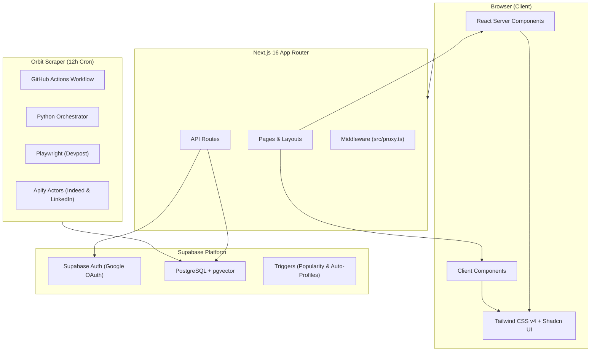

# DevDrift — Project State & Implementation Plan

> **Last updated:** June 8, 2026  
> **Phase:** 1 (Foundation) ✅ · 2 (Data Aggregation & Scraper) ✅ · 3 (Core UI & Recommendations) ✅ · 4 (Auth & Onboarding) ✅  
> **Build Status:** ✅ Production build passes (`npm run build` — compiled successfully)
> **Supabase Status:** ✅ Schema configured with pgvector and automated triggers

---

## Table of Contents

1. [Project Overview](#1-project-overview)
2. [Tech Stack & Architecture](#2-tech-stack--architecture)
3. [Project Structure](#3-project-structure)
4. [Supabase Database Schema](#4-supabase-database-schema)
5. [Authentication & Session Management](#5-authentication--session-management)
6. [Data Aggregation & Scraping (Orbit Pipeline)](#6-data-aggregation--scraping-orbit-pipeline)
7. [Recommendation Engine & API](#7-recommendation-engine--api)
8. [Implementation Checklist (Completed)](#8-implementation-checklist-completed)
9. [Setup & Configuration Guide](#9-setup--configuration-guide)
10. [Pending Requirements & Next Steps](#10-pending-requirements--next-steps)

---

## 1. Project Overview

**DevDrift** is a premium developer opportunity discovery platform designed to aggregate, categorize, and recommend hackathons, jobs, and internships.
Built with a dark-mode-first aesthetic (utilizing Tailwind CSS v4, Framer Motion, and Shadcn UI), DevDrift features:
- **Semantic Discovery:** Powered by `pgvector` with 384-dimensional opportunity embeddings.
- **Personalized Recommendation Feed:** Uses cosine similarity and tag-overlap fallback re-ranked by time-decay.
- **Robust Scraping (Orbit):** A scheduled Python pipeline leveraging Apify Managed Scraping Actors to bypass anti-bot protections.

---

## 2. Tech Stack & Architecture

### 2.1 Core Technologies
- **Framework:** Next.js (App Router) `16.2.7`
- **Frontend Core:** React `19.2.4` & TypeScript `^5` (Strict Mode)
- **Styling:** Tailwind CSS `^4` (OKLCH color space theme variables, premium gradients, card glows)
- **Animations:** Framer Motion `^12.40.0` (smooth spring-physics transitions, tab transitions)
- **Database:** Supabase PostgreSQL with `pgvector` (vector index support) and custom triggers
- **Local Embedding Engine:** `@xenova/transformers` (`all-MiniLM-L6-v2` model running locally to create user/listing embeddings)
- **Scraper (Orbit):** Python `3.11` + Playwright (for Devpost) + Apify SDK client (for Indeed and LinkedIn via `curious_coder/linkedin-jobs-scraper`)
- **Scheduler:** GitHub Actions (configured to run on a 12-hour cron job)

### 2.2 System Architecture Diagram



---

## 3. Project Structure

```
DevDrift/
├── .github/
│   └── workflows/
│       └── scrape.yml              # GitHub Actions scraper cron (12-hour schedule)
├── scraper/                        # Orbit Data Aggregation Scraper Pipeline (Python)
│   ├── config.py                   # Indeed/LinkedIn crawler configurations & targets
│   ├── apify.py                    # Apify SDK integration for Indeed & LinkedIn actors
│   ├── normalizer.py               # Field standardizer & job/internship auto-classifier
│   ├── jobs.py                     # Indeed & LinkedIn search merger and de-duplicator
│   ├── devpost.py                  # Playwright-based Devpost scraper
│   ├── db.py                       # Supabase client integration & sync layers
│   ├── requirements.txt            # Python dependencies (apify-client, playwright, supabase, etc.)
│   └── main.py                     # Entrypoint orchestration script
├── src/
│   ├── app/                        # Next.js App Router Pages
│   │   ├── (auth)/
│   │   │   └── login/
│   │   │       ├── actions.ts      # Server actions (Credentials & Google OAuth with dynamic redirect)
│   │   │       └── page.tsx        # Sign-in/Sign-up page
│   │   ├── api/
│   │   │   ├── listings/           # GET /api/listings (paginated search)
│   │   │   └── recommendations/    # GET /api/recommendations (personalized feed)
│   │   ├── auth/
│   │   │   └── callback/
│   │   │       └── route.ts        # GET auth callback (handles OAuth token exchanging & redirect)
│   │   ├── discover/
│   │   │   ├── page.tsx            # Discover page shell
│   │   │   └── DiscoveryClient.tsx # Search & filter feed
│   │   ├── onboarding/
│   │   │   └── page.tsx            # User interest tag selector (onboarding page)
│   │   ├── profile/
│   │   │   └── page.tsx            # User profile dashboard (saved listings & tags)
│   │   ├── globals.css             # Tailwind v4 theme configurations
│   │   ├── layout.tsx              # Base page layout (Outfit font, dark mode)
│   │   └── page.tsx                # Home feed and landing layout
│   ├── components/
│   │   ├── FilterBar.tsx           # Search/filter controls
│   │   ├── HomeFeed.tsx            # Infinite scroll feed
│   │   ├── ListingCard.tsx         # Opportunity card component (optimistic saving state)
│   │   ├── ListingCardSkeleton.tsx # Shimmer placeholders
│   │   ├── Navbar.tsx              # Server components shell
│   │   └── NavbarClient.tsx        # Authenticated UI controls
│   ├── hooks/
│   │   ├── useInfiniteScroll.ts    # Observer hooks
│   │   └── useListings.ts          # Listings search hook
│   ├── lib/
│   │   ├── supabase/
│   │   │   ├── client.ts           # Browser client
│   │   │   ├── server.ts           # Server client (cookies based)
│   │   │   ├── middleware.ts       # Token refresh helper
│   │   │   └── interactions.ts     # Save/Unsave DB integrations
│   │   └── utils.ts                # Tailwind class mergers
│   ├── proxy.ts                    # Middleware runner (invokes src/lib/supabase/middleware.ts)
│   └── types/
│       └── database.ts             # Database models
├── supabase/
│   └── migrations/
│       ├── 00001_initial_schema.sql         # Database tables, RLS, custom functions
│       ├── 00002_recommendation_engine.sql  # Cosine similarity recommendation engine
│       └── 00003_popularity_trigger.sql     # View/save interaction-driven popularity triggers
```

> [!NOTE]
> Next.js middleware is located in [src/proxy.ts](file:///c:/Users/SmilinJasper/Desktop/projects/Test/DevDrift/src/proxy.ts) which acts as the edge middleware. Note that for standard Next.js routing detection without custom build scripts, this file should ideally be named `middleware.ts` in the root of `src/`.

---

## 4. Supabase Database Schema

### 4.1 Extensions
- `vector` (schema: extensions): 384-dimensional vector embedding column.
- `pg_trgm` (schema: extensions): Trigrams support for fuzzy text matching.
- `moddatetime` (schema: extensions): Auto updated_at timestamp trigger integration.

### 4.2 Custom Enums
- `public.listing_type`: `'hackathon' | 'job' | 'internship'`
- `public.interaction_kind`: `'view' | 'save'`

### 4.3 Database Tables

#### Table: `public.profiles`
- `id` (UUID, primary key): References `auth.users(id)` (ON DELETE CASCADE)
- `username` (TEXT, unique): Required (length constraint: 3–40 characters)
- `full_name` (TEXT)
- `avatar_url` (TEXT)
- `bio` (TEXT): Constraint <= 500 characters
- `interests` (TEXT[]): Array of tags representing user interests
- `interest_embedding` (vector(384)): Local semantic representation of interest tags
- `location` (TEXT)
- `website_url` (TEXT)
- `created_at` (TIMESTAMPTZ, default now())
- `updated_at` (TIMESTAMPTZ, default now())

#### Table: `public.listings`
- `id` (UUID, primary key): Default `gen_random_uuid()`
- `created_by` (UUID): References `public.profiles(id)` (ON DELETE CASCADE)
- `title` (TEXT): Required (length constraint: 1–200 characters)
- `description` (TEXT)
- `type` (`public.listing_type`): Enum type (`hackathon`, `job`, `internship`)
- `tags` (TEXT[]): List of tags/skills
- `location` (TEXT): Free-form string representation (e.g., "Remote", "India", "San Francisco")
- `is_remote` (BOOLEAN): Default false
- `starts_at` (TIMESTAMPTZ)
- `ends_at` (TIMESTAMPTZ)
- `application_url` (TEXT): Unique application redirect url (used as primary de-duplication key)
- `popularity_score` (FLOAT): Defaults to `0.0`
- `embedding` (vector(384)): Vector representation of the listing for search / similarity
- `is_published` (BOOLEAN): Default true
- `created_at` (TIMESTAMPTZ, default now())
- `updated_at` (TIMESTAMPTZ, default now())

#### Table: `public.interactions`
- `id` (UUID, primary key): Default `gen_random_uuid()`
- `user_id` (UUID): References `public.profiles(id)` (ON DELETE CASCADE)
- `listing_id` (UUID): References `public.listings(id)` (ON DELETE CASCADE)
- `kind` (`public.interaction_kind`): Enum type (`view`, `save`)
- `created_at` (TIMESTAMPTZ, default now())
- *Constraint:* Unique composite index on `(user_id, listing_id, kind)` to prevent duplicate saves.

### 4.4 Automated Database Triggers
1. **Timestamp Triggers:** Auto-updates `updated_at` timestamps on `public.profiles` and `public.listings` when rows update.
2. **Auto-Profile Trigger (`on_auth_user_created`):** When a new user signs up in `auth.users`, a database trigger calls `handle_new_user()` to automatically create a matching `public.profiles` row with username defaults.
3. **Popularity Score Trigger (`trigger_update_listing_popularity`):** Attached to `public.interactions`. Automatically updates listing popularity when saves or views are registered or removed:
   - Save Registered: `+5.0`
   - View Registered: `+1.0`
   - Save Removed (Unsaved): `-5.0`
   - View Removed: `-1.0`
   - Floor constraint prevents `popularity_score` from falling below `0.0`.

---

## 5. Authentication & Session Management

DevDrift supports Sign-In and Sign-Up using:
1. **Credentials:** Email and password flow.
2. **OAuth Provider:** Google Authentication.

### 5.1 Dynamic Redirect Resolution (Vercel Fix)
To prevent authentication flows from redirecting users to `localhost` when logging in on production deployments, redirects are dynamically resolved using Vercel environments and request headers:
- **Server Action Setup (`loginWithGoogle` in actions.ts):**
  ```typescript
  const getSiteUrl = async () => {
    if (process.env.NEXT_PUBLIC_SITE_URL) return process.env.NEXT_PUBLIC_SITE_URL;
    if (process.env.VERCEL_PROJECT_PRODUCTION_URL) return `https://${process.env.VERCEL_PROJECT_PRODUCTION_URL}`;
    if (process.env.VERCEL_URL) return `https://${process.env.VERCEL_URL}`;
    
    // Fully dynamic fallback using request host headers
    const headersList = await headers();
    const host = headersList.get("host");
    const protocol = headersList.get("x-forwarded-proto") || "https";
    return `${protocol}://${host}`;
  };
  ```
- **Callback Verification (`auth/callback/route.ts`):** Resolves the target host via the `host` and `x-forwarded-proto` headers:
  ```typescript
  const headersList = await headers();
  const host = headersList.get("host");
  const protocol = headersList.get("x-forwarded-proto") || "https";
  const origin = host ? `${protocol}://${host}` : new URL(request.url).origin;
  ```

---

## 6. Data Aggregation & Scraping (Orbit Pipeline)

Direct scraping of platforms (LinkedIn, Glassdoor, Indeed) using Playwright in continuous integration (GitHub Actions) causes immediate blockage due to anti-bot measures. The Orbit scraper pipeline is migrated to use Apify's Managed Actors.

### 6.1 Architecture & Components
- **Orchestration (`scraper/main.py`):** Runs the pipeline in 3 stages:
  - Stage 1: Devpost Hackathons scraping (using local Playwright).
  - Stage 2: Jobs/Internships scraping (executes Indeed/LinkedIn Apify actors, normalizes schema, runs deduplication).
  - Stage 3: Syncs outputs into Supabase using a Service Role client.
- **Indeed Scraper (`borderline/indeed-scraper`):** 
  - Searches country inputs: `["US", "IN"]` (United States, India).
  - Search keywords: `"software intern"`, `"software"`.
  - Max items limit: `15` items per query to preserve free-tier credits.
- **LinkedIn Scraper (`curious_coder/linkedin-jobs-scraper`):**
  - Scrapes opportunities using pre-formed, time-sorted incognito search queries.
  - Search URL targets:
    - Keywords: "software" in India.
    - Keywords: "software intern" globally.
    - Keywords: "software" globally.
  - Max items limit: `25` across all URLs combined.
  - Scrapes with `scrapeCompany = False` to optimize credits.

### 6.2 Data Normalization & Auto-Classification
- **Indeed normalizer mappings:** Maps `positionName` to title, appends `company` name to title, strips HTML from description, maps apply link (with fallback to default url), and classifies.
- **LinkedIn normalizer mappings:** Maps `title` to title, appends `company` to title, strips HTML, maps `jobUrl`, parses posted dates into starts_at format, and extracts tags.
- **Auto-Detection (`_detect_listing_type` in normalizer.py):** Auto-classifies whether listings are `internship` or `job` based on regex searches for internship keywords (`\b(intern|internship|co-op|coop)\b`) in listing titles and descriptions. Standardizes output types to fit `public.listing_type` values (`job`, `internship`, `hackathon`).

### 6.3 Multi-Level Deduplication
To prevent duplicate opportunity synchronization:
- **Indeed Deduplication:** Filters and deduplicates listings by URL/apply link during raw scraping.
- **LinkedIn Deduplication:** Filters results by unique `jobUrl` during scraping.
- **Cross-Source Deduplication:** Combines Indeed and LinkedIn scraped structures, executing a case-insensitive match on a compounded key: `{title}|{company}`. If a job is listed on both platforms, only the first encountered instance is synced.
- **Supabase Upsert Sync:** Inside `scraper/db.py`, queries the database for existing opportunities and checks `application_url` collisions, performing updates on existing records and inserts on new records.

---

## 7. Recommendation Engine & API

### 7.1 Database RPC `recommend_listings_for_user`
Implemented in `00002_recommendation_engine.sql`. Accept parameters `p_user_id`, `p_match_threshold`, `p_limit`, `p_cursor_score`, and `p_cursor_id`. Uses two strategies:
1. **Strategy 1 (Vector Match):** If user has computed interest embeddings, queries listings sorted by `1 - (listing.embedding <=> user.interest_embedding)` descending.
2. **Strategy 2 (Fallback Score):** If user has no embeddings set, calculates matching score:
   $$\text{Score} = (\text{Overlap Ratio} \times 0.7) + (\text{Normalized Popularity} \times 0.3)$$
   where overlap is the number of shared tags divided by user tags.
- Both strategies exclude opportunities the user has already saved or viewed.
- Supports keyset pagination using composite cursor scores and IDs.

### 7.2 API Server Re-ranking
The recommendation route `GET /api/recommendations` retrieves listings from the database RPC and overlays a temporal decay function:
$$\text{final\_score} = \text{similarity} \times e^{-0.01 \times \text{days\_since\_created}}$$
This decay re-ranks listings server-side, boosting newly aggregated opportunities and pushing older records down, without degrading indexing speeds inside Postgres.

---

## 8. Implementation Checklist (Completed)

- [x] **Project Scaffolding:** Tailwind CSS v4, Next.js 16 (App Router), Shadcn UI elements (`button`, `card`, `tabs`, `input`, `badge`, `skeleton`, `dialog`), Outfit geometric font styling.
- [x] **Supabase Integration:** Client utilities (`client.ts`, `server.ts`, `middleware.ts`, `interactions.ts`) configured using cookie-based token exchanges.
- [x] **Authentication Flow:** Credential login/signup, Google OAuth with dynamic redirect URL resolution via host headers for Vercel deployment.
- [x] **Onboarding Process:** Page for users to select interest tags, saving tags directly, and triggering profile creation.
- [x] **Database Architecture:** `profiles`, `listings`, and `interactions` schemas. Indexes created for username search, tag queries, popularity indexes, and `IVFFlat` pgvector query optimizations. Triggers for modified dates and interaction-based popularity scoring.
- [x] **Scraper Transition (Orbit):** Python pipeline using Apify Client SDK to crawl Indeed and LinkedIn. Auto-detects job vs internship listing types. Implements source-specific and title-company cross-source deduplication.
- [x] **Discovery Feed UI:** Interactive listings feed (`DiscoveryClient.tsx` + `HomeFeed.tsx`) with Framer Motion spring actions, active filters for listing types, keyword filtering, and optimistic save buttons.
- [x] **User Dashboard:** Profile page (`src/app/profile/page.tsx`) illustrating saved user opportunities and active interest tags.
- [x] **GitHub Actions Workflow:** `.github/workflows/scrape.yml` configured to trigger every 12 hours with environment vars and secret mapping.

---

## 9. Setup & Configuration Guide

To deploy or test the application locally or in production, ensure the following configurations are complete.

### 9.1 Environment Variables (`.env.local`)
Create a `.env.local` file in the project root:
```bash
# Supabase Configurations
NEXT_PUBLIC_SUPABASE_URL=https://your-supabase-project.supabase.co
NEXT_PUBLIC_SUPABASE_ANON_KEY=your-supabase-anon-key
SUPABASE_SERVICE_ROLE_KEY=your-supabase-service-role-key

# Scraper Pipeline Credentials (Required for scraper/main.py)
APIFY_API_TOKEN=your-apify-api-token
```

### 9.2 GitHub Secrets (For Scraper Pipeline)
Add the following secrets to your GitHub Repository settings (`Settings > Secrets and variables > Actions`):
- `SUPABASE_URL`
- `SUPABASE_SERVICE_ROLE_KEY`
- `APIFY_API_TOKEN`

### 9.3 Apify Actor Setup
Before running the scraping pipeline, add the following actors to your Apify account (free tier supports up to $5/month credits):
1. **Indeed Scraper:** `borderline/indeed-scraper`
2. **LinkedIn Jobs Scraper:** `curious_coder/linkedin-jobs-scraper`

---

## 10. Pending Requirements & Next Steps

When continuing in a new conversation, focus on the following tasks:

### 10.1 Production Scraper Test
- [ ] Run the scrape workflow in dry-run mode in the GHA environment to verify credential integration.
- [ ] Trigger the live scraper to sync crawled Indeed and LinkedIn results to the database and review record counts.

### 10.2 Semantic Natural Language Search
- [ ] Incorporate a search bar inside `FilterBar.tsx` for natural language querying.
- [ ] Build a database API search route `POST /api/search` using the `match_listings` Postgres RPC to calculate cosine vector similarity of search terms.
- [ ] Auto-calculate query embeddings client-side or server-side utilizing `@xenova/transformers`.

### 10.3 Profile Session Middleware Optimization
- [ ] Ensure that `src/proxy.ts` is renamed to `src/middleware.ts` in the project root so Next.js correctly intercepts requests on edge runtimes.
- [ ] Replace temporary client-side guest fallback IDs with actual session credentials.

### 10.4 View Tracking Analytics
- [ ] Implement event log tracking inside the Listing details page or on card expanded actions to record "view" interactions.
- [ ] Connect tracking to trigger database popularity updates.
